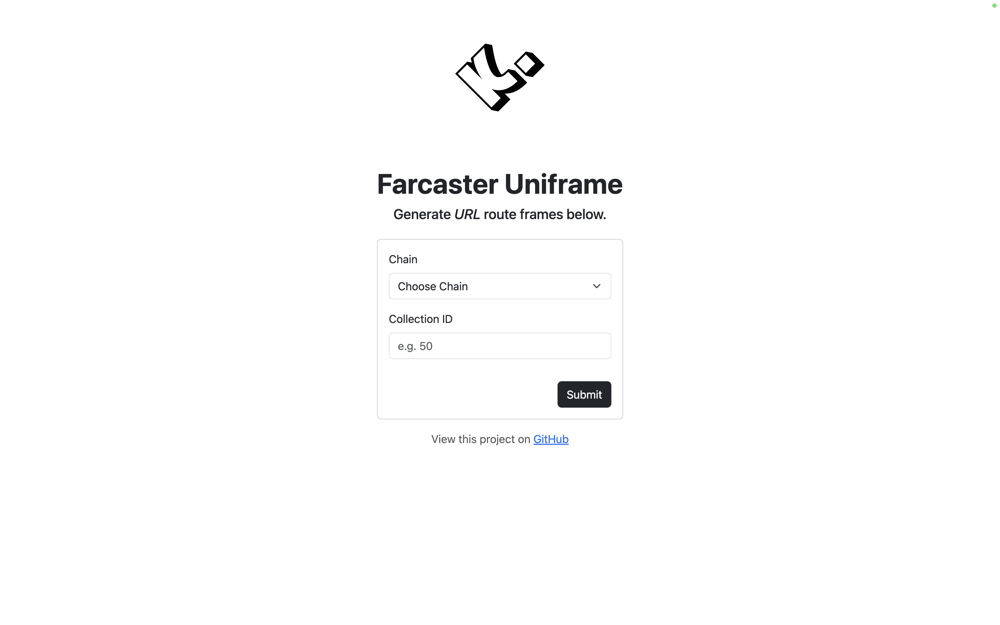
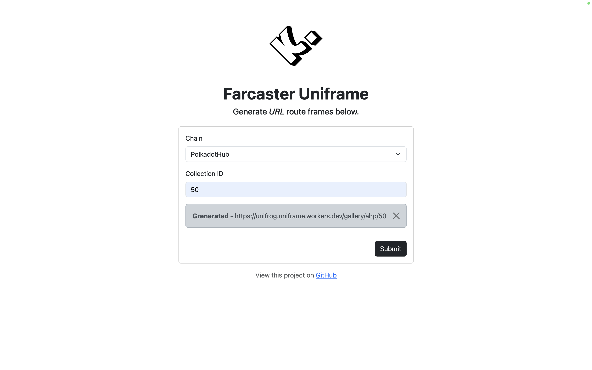
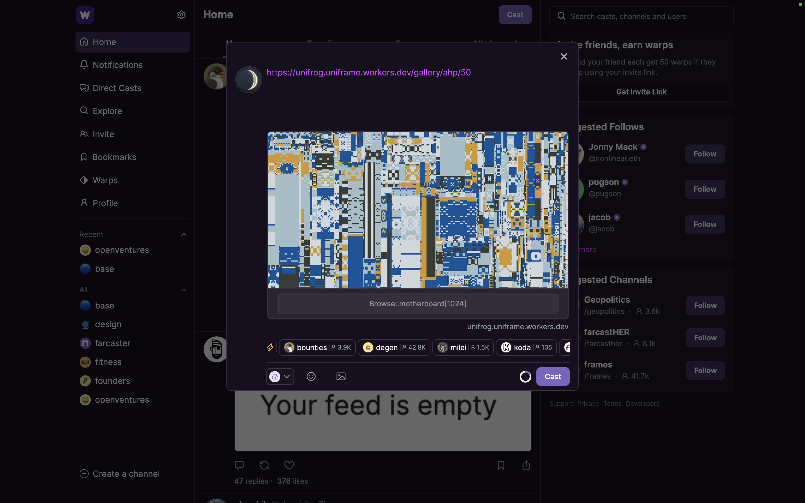
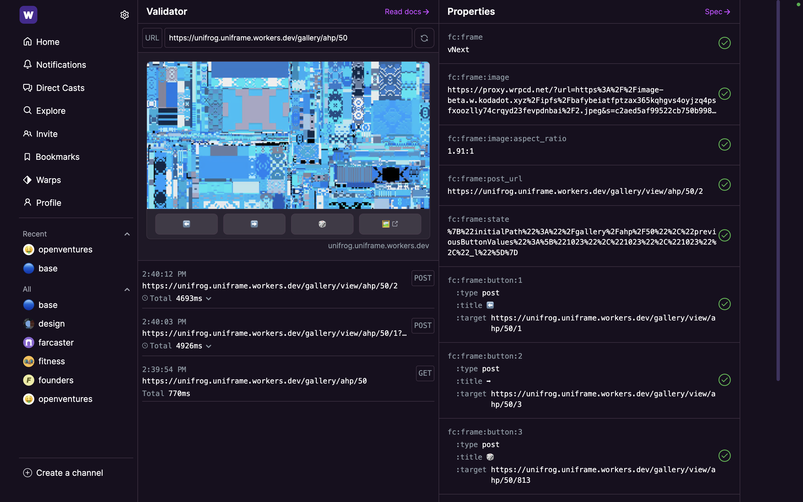
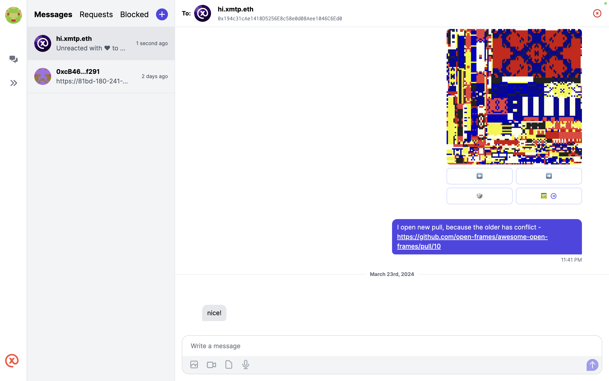

## Frontend

Build https://unikoda.vercel.app/ with Python Flask.

> Install.

```
pip install -r requirements.txt
```

> Running.

```
flask run
```

or

```
python index.py
```

### Dashboard

Before start to generate the `url route`, find the `chain` and `collection id` on this website https://kodadot.xyz/.



### Generate URL Route

After submit, it will redirect automatically to https://warpcast.com/ using cast intens.

```
https://warpcast.com/~/compose?text={URL_Route}.
```



## Frames

> Command.

All command can be found here - [Frames Readme](frames/README.md).

### Frame Overview

The cast view on Warpcast.



The frame.



The frame can be view using `XMTP` - https://xmtp.chat/ tho.

